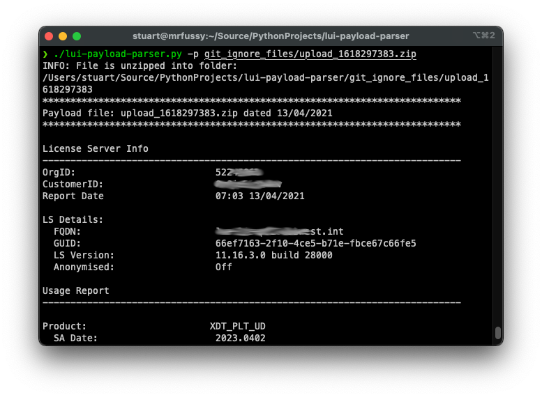

# lui-payload-parser 

## Overview
A simple Python 3 script to parse LUI payload files. These are .zip files, produced by the CSP license server daily, which XML formatted data files:
1. manifest.xml
2. report.xml

## Requirement
Python 3 (3.9.3 used for dev)

## Usage
```
usage: lui-payload-parser.py [-h] -p PAYLOAD [-o] [-u] [-a] [-s] [-l] [-m] [-q]

optional arguments:
  -h, --help            show this help message and exit
  -p PAYLOAD, --payload PAYLOAD [REQUIRED]
                        Payload file to parse.
  -o, --output-to-file  Store parsed output to file as well as echoed to
                        screen.
  -u, --users           Include active users for each user billable SKU.
  -a, --all-skus        Include SKUs that aren't billable.
  -s, --serial-numbers  Include license serial numbers.
  -l, --license-server-plaform
                        Include License Server Platform details.
  -m, --manifest        Include manifest data in output.
  -q, --quiet           Quieten output. Automatically forces output to file.
```

For example

```
python3 ./lui-payload-parser -p ./upload_xxxxxxxxxx.zip -o
```



## Features
User of the `-o` / `--output-to-file` flag creates a text output file to be created, in the same directory of the payload file, with the name `upload_xxxxxxxx.txt`. The `q` / `--quiet` flag forces the output file to be created.
	
## Author
Stuart Parkington, Lead SE, CSP EMEA

## Licence

Please see license.txt.
